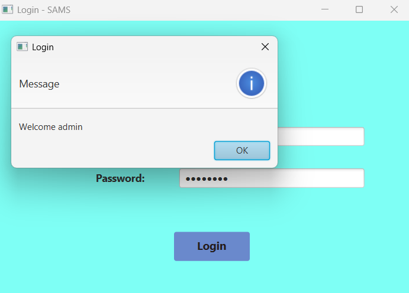

# SAMS
Student Attendance Management System
SAMS is a JavaFX, Hibernate, MySQL based desktop application designed to help educational institutions efficiently manage student attendance. It supports manage courses, students, lecturers, class schedules, marking attendance, reporting, and role based login access.

Setup instructions
1. Clone the repository - https://github.com/Lihini-Lochana/SAMS.git
2. Import the project - Open in IDE IntelliJ IDEA - Make sure JDK 21 and JavaFX SDK are configured.
3. Configure database - Create a MySQL database named sams - Run the provided SQL script in /db/database.sql to create tables.
4. Update Hibernate config - In hibernate.cfg.xml, set MySQL username and password.
5. To start Application, Run the Main.java file.

Technologies Used - JavaFX, Hibernate, MySQL, Maven, Layered Architecture

Login credentials

Role - admin,  Username - admin,  Password - admin123

Role - lecturer,  Username - lect1,  Password - lect123

User Interfaces - Screenshots

